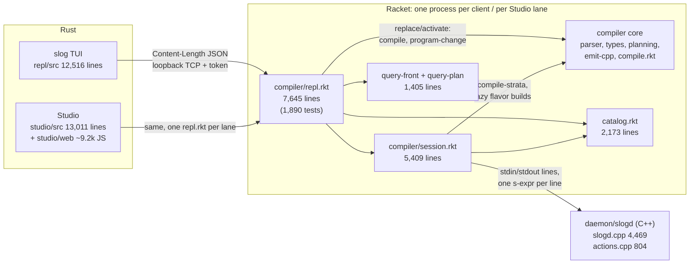
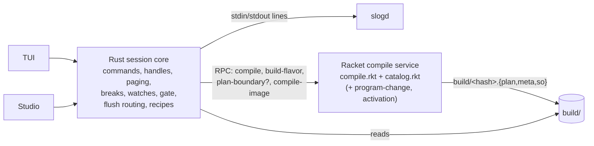
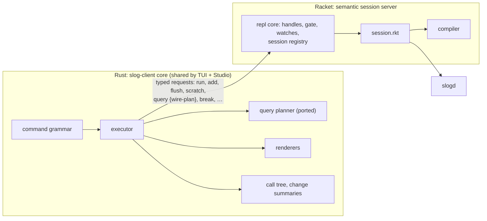

# Severing Racket: moving the REPL's non-core layers into Rust

2026-10-06, branch `docs/severing-racket` (off `web-repl` at `8fd5c8a`).
This is a design exploration. It changes no code.

Kris's question: the REPL is one 7,645-line Racket file. Could it split into
(1) a small Ratatui TUI kept at parity with today's REPL, (2) the features the
web REPL needs, and (3) more of the system written in Rust, cleanly separate
from Slog's core execution? Nothing big should change yet.

**Short answer.** Yes, but the cut belongs in a different place than the
file boundaries suggest. `repl.rkt` is mostly *presentation and command
plumbing* around a small set of compiler calls, and that part can leave
Racket cheaply and incrementally. `session.rkt` is different. Compiler
artifacts are woven into its control flow: it compiles against the live
schema, lazy build closures run codegen in the middle of a flush, it mints
identity keys that must be byte-stable, and the batch runner (`slog -d`)
loads saved sessions through it. Porting it is a large rewrite, not a move.

The recommendation (§5) is to make the Racket server's answers *data*,
render them in a shared Rust core that both the TUI and Studio use, split
what remains of `repl.rkt` into modules, and only then decide whether the
session layer should move, using measurements and a differential harness
that the earlier steps produce.

Contents:
1. [What is there today](#1-what-is-there-today)
2. [Inventory of the Racket REPL by responsibility](#2-inventory-by-responsibility)
3. [Measurements](#3-measurements)
4. [Candidate architectures](#4-candidate-architectures)
5. [Recommendation and staged plan](#5-recommendation-and-staged-plan)
6. [What's in the way](#6-whats-in-the-way)
7. [Appendix: method and raw numbers](#appendix-method-and-raw-numbers)

---

## 1. What is there today

The facts this rests on:

- **Clients.** The TUI and Studio both launch `racket compiler/repl.rkt`
  (`repl/src/server.rs:31-43`). Each authenticates with `hello` plus a token
  and then sends one method, `command {line}`, for every REPL command
  (`repl/src/protocol.rs:68-99`). A second connection carries only
  `interrupt` (`compiler/repl.rkt:5667-5679`). The server never pushes; every
  exchange is request/response.
- **Rust holds no Slog semantics.** No Rust code talks to `slogd`. The only
  contact is a file-mtime check (`repl/src/server.rs:82-103`). Studio uses
  just `protocol::{Response, ServerError, SessionConnection}` and
  `server::{launch, …}` from the `slog-repl` library crate
  (`studio/src/lane.rs:12-13`).
- **Racket renders text.** Every answer carries `kind`, `title` and `lines`,
  rendered in Racket (`text-result`, `repl.rkt:432`). Many answers also carry
  structured fields (§2.4). 43 distinct `#:kind` values come from 80
  `text-result`/`semantic-text-result` call sites, and the non-test body
  contains 341 `format` calls.
- **The daemon protocol is already all command verbs.** Client actions live
  in `daemon/actions.cpp` (verb chain at `:301-781`, header `:1-15`: "were
  once generated plugins…"). Strata, however, are still sent as artifact
  *paths*: a `.plan` path is interpreted (`daemon/plan-count.cpp:2268-2291`),
  and anything else is `dlopen`ed (`daemon/slogd.cpp:145-197`). The line
  protocol is documented in `docs/t0-contract.md`, and the client protocol in
  `docs/repl-terminal.md` §4.
- **One Racket process per lane.** Studio runs a main lane per user/project
  (capped at 4 by default, `studio/src/main.rs:258-262`), plus preview,
  exploration, Debug-mode, scenario and knowledge lanes. Each lane is a
  separate `repl.rkt` with its own daemons (`studio/src/lane.rs:1-9`).

---

## 2. Inventory by responsibility

### 2.1 `compiler/repl.rkt`: 5,755 lines of code plus 1,890 of tests

Ranges run from one `define` to the next, so they include comments. Each
family is classified as **C** (needs the compiler or a compiler artifact),
**O** (orchestration over `session.rkt` or the daemon), or **P**
(presentation: text, help, formatting). "Compiler calls" lists only calls
`repl.rkt` makes itself. Calls made through `session.rkt` are in §2.2.

| Family | Where | Lines | C / O / P | What actually needs the compiler |
|---|---|---:|---|---|
| Wire: framing, envelope, auth, listener, control conn | 141-202, 5546-5743 | ~260 | P/transport | nothing |
| Server state, session registry, `attach-session-state` | 60-140, 204-290 | ~170 | O | nothing |
| Help text | 296-422 | 127 | P | nothing |
| Command parsing (`split-command`, `read-command-data`, `read-signed-changes`, raw-line routing for `?`, scratch heads, bare facts) | 423-488, 4124-4141, 5085-5117 | ~120 | parse | Racket `read` for Slog datums. Raw-line routing only *recognises* Slog keywords (4124-4131) |
| Run / evaluate (`run`, `recount`, `counts`) | 5278-5323 | 46 | O | none directly: `session-run!` compiles |
| Change records and summaries (`capture-semantic-change`, `assemble-change`, `change-summary-lines`, …) | 3579-3881 | 303 | O + P | none. It *parses daemon echo lines* (`route`, `tier`, `refused`, `fixpoint`, 3599-3651) |
| Value handles `#N` | 489-665 | 177 | O | catalog type keys for drift checks (574-643) |
| Catalog projection, `tables`, `catalog` | 690-988 | ~300 | O + P | catalog.rkt record accessors only |
| `count`, `show`, `query`/`has` | 1153-1301 | 149 | O + P | catalog accessors |
| `?` register, `more`, `cancel`, `dump`, `uses` | 1302-1766 | 465 | **C** (query planner) + O + P | `parse-query-line`, `plan-query`, `query-plan->wire-string` (1571-1611). These modules import nothing from the compiler (§2.4) |
| `explain` | 3546-3578 | 33 | C (query planner) + P | same |
| `add`/`del`/`stage`/`unstage`/`flush` | 454-488, 666-689, 5212-5273, 5328-5367 | ~161 | O | `check-edit-tuple!` checks values against catalog descriptors (666) |
| Scratch (register, show, clear, keep) | 4117-4259 | 143 | O | none directly: `session-scratch-add!` compiles (§2.2) |
| Databases: `open`, `csv-import`, `current`, `resident`, `discard`, `mode`, `library`, `save`, `attach`, `status` | 3928-4116 + inline | ~311 | O | dbtool and `convert-db-folder` (tools.rkt), which are file tooling, not the compiler |
| Watches, derived watches, settling | 1767-1941, 2249-2325, 3398-3545 | ~400 | O (+C for query watches) | `run-watch-query` uses the query planner (1816) |
| `whynot` (failure frontier) | 2326-2667 | 342 | **C-artifact** | unification over canonical-plan rules read from `build/<hash>.plan` (`session-plan-rules`, 4341) |
| Breaks (location, clause), `unbreak`, `breaks`, `enable`/`disable` | 2668-2978, 3282-3346 | ~375 | O + C-artifact | location breaks read `.plan` files through `plan-artifact->kernel-plans` (canonical-plan.rkt) |
| Demand calls, `logs`, step into/over/out | 2979-3397 (less clause breaks) | ~355 | O + P | demand-debug.rkt (298 lines), which reads the daemon's demand log; it needs no compiler |
| Pause gate, held runs, `frames`, `peek`, interrupt | 4486-4755, 4908-5084 | ~447 | O | nothing. It is concurrency plumbing (Racket threads and channels, §6.4) |
| `why` | 4795-4907 | 113 | O + P (+query *parser*) | `parse-query-line` for the fact term |
| `trace` | 4756-4794, 3821-3852 | ~71 | O + P | nothing |
| `rename`/`drop` | 5368-5402 | 35 | O | nothing directly |
| Program images, `tiers` | 989-1152, 4260-4297 | 202 | O + P | nothing (daemon `catalog` streams) |
| `code` | 4298-4475 | ~178 | C-artifact + P | reads `.plan` and kernel plans |
| `replace` / `preview` / `activate` / `whatif` | 1942-2248 | 307 | **C** | `load-program-list`, `program->jobs`, `emit-program-image`, `seal-program-draft`, change-pcs, activation (1960-2020) |
| `state`, `schema`, `pipeline` | 3882-3927 + inline | ~70 | O + P | nothing |
| Dispatch table (inline handlers counted above) | 5085-5540 | 456 | — | — |

**Totals.** Of about 5,755 lines of code, the families that call the
compiler front end or back end *themselves* are only `replace`/`activate`
(~300 lines). Families that need a compiler *artifact* or the pure query
planner come to roughly 1,500 lines: `?`/`dump`/`explain`, `whynot`, location
breaks, `code`, query watches. Everything else is orchestration and
presentation, interleaved inside each handler. A typical handler validates,
calls a `session-*` function, and formats lines in the same `define`.

### 2.2 `compiler/session.rkt`: 5,409 lines, no test module

| Region | Lines | n | Kind |
|---|---|---:|---|
| Design header, provides (55 clauses), requires | 1-129 | 129 | — |
| Model: `sinfo`, `session`, `scratch-event` structs | 130-238 | 109 | model |
| Daemon spawn and line-protocol primitives | 240-377 | 138 | protocol |
| Hooks: `session-prepare-hook`, `session-pause-hook` | 379-412 | 34 | hooks |
| Stratum pump `drive-to-fixpoint!`, sends, tier swaps, `session-tiers` | 414-594 | 181 | protocol + tiers |
| Identity ledger, rule meta, fires | 596-694 | 99 | identity |
| Trace | 696-821 | 125 | protocol |
| Activation transaction (`session-activate!`, `-pcs!`) | 823-1038 | 216 | **compiler** + orchestration |
| SCC policy, artifact choice per send | 1040-1081 | 42 | tiers |
| Recount (count epochs) | 1083-1232 | 150 | maintenance |
| Daemon state queries, `session-action!` | 1234-1403 | 170 | protocol |
| Recipe bookkeeping (`record-step!`, log, recipe) | 1405-1487 | 83 | bookkeeping |
| Open and load replay | 1489-1767 | 279 | databases + **compiler** (replay recompiles, 1639) |
| Rename/drop (N3-D path transforms) | 1782-1922 | 141 | boundaries |
| Attachment helpers, N4-A restore, attach | 1924-2312 | 387 | boundaries + databases |
| Live catalog observation | 2314-2449 | 136 | boundaries |
| Bundle accumulation (`install-head!`, …) | 2451-2641 | 191 | bookkeeping |
| Boundary wire encoding | 2643-2799 | 157 | protocol encoding |
| `plan-compile-groups` | 2801-2907 | 107 | boundaries + **compiler** |
| `session-run!` | 2909-3189 | 281 | boundaries + **compiler** |
| Staging, `whatif`, inject, import/link | 3191-3434 | 241 | orchestration |
| `introspect!`, cone closure, rebound guard | 3436-3554 | 119 | routing |
| Overlay logs, `normalize-pending!`, `resolve-anchor`, `session-flush!` | 3556-3759 | 203 | routing |
| **`tip-flush!`: the maintenance route ladder** | 3765-4838 | **1,078** | routing |
| `anchored-walk!`, suffix walk, reenter/rerun | 4840-5043 | 203 | routing |
| Scratch: add, events, clear, keep | 5045-5256 | 212 | scratch (+ **compiler** via `session-run!`) |
| Save, close, runslog loader hook | 5258-5409 | 152 | databases |

By kind:

- **Pure daemon orchestration and routing:** about 2,300 lines (spawn,
  pump, trace, recount, state queries, introspection, flush, the ladder,
  walks).
- **Boundary and catalog bookkeeping:** about 1,000 lines (rename/drop,
  attach/restore, live catalog, bundle, boundary encoding).
- **Compiler-entangled:** about 1,100 lines (`session-run!`,
  `plan-compile-groups`, replay, activation, scratch).

The 2,300 lines of "orchestration" are not compiler-free, though. The
compiler runs *inside* them, as follows.

**Where the compiler enters session.rkt:**

- **`compile-strata`** (compile.rkt:1652) is called with *live session
  state* as input. The manifest is the daemon's current schema when the
  session has state (session.rkt:2917-2923). The input catalog is the
  session's head boundary catalog (2931-2932). `current-source-capture` and
  `current-catalog-adoption` are parameterised (2926, 5099-5100, 1632-1638).
  The compiler therefore needs session state, which the session layer owns.
- **Lazy `sbuild` thunks.** Codegen, and sometimes clang, run when a
  stratum's count, delta or maintenance flavor is first forced. That happens
  *on the flush path, inside an open update epoch*: count at 1225, delta at
  4827, maintenance flavors at more than 20 sites in `tip-flush!` (4318-4821).
  `ensure-delta-so` runs a synchronous clang -O0 unless `SLOG_OPT=interp`
  (compile.rkt:957-971).
- **Upgrade closures.** At iteration boundaries the pump swaps in a native
  artifact when one is ready (474, 549-557).
- **Pure planning from catalog.rkt.** Callers include `plan-boundary`
  (2879), `mint-program-identity` (2966), path transforms (1850, 1907),
  attachment (2222) and bundle restore (2024). This is not the compiler, but
  it is key-minting code whose output must be byte-identical on replay
  (206-212, 2955-2960).

**Who else depends on session.rkt.** It is not REPL-only. It installs the
recipe-chain loader that the one-shot driver uses for `slog -d NAME`,
`verify --replay` and `db freeze` whenever a chain holds a saved session
(session.rkt:5397-5409, runslog.rkt:40-50). `compiler/run.rkt` requires it,
as do about 19 test drivers. Of its 55 exports, `repl.rkt` uses 35; 19 are
used only by runslog, run.rkt or tests.

### 2.3 `compiler/catalog.rkt`: 2,173 lines

The header says "deliberately has no daemon or session dependency"
(catalog.rkt:6), and it requires only `ir-shared.rkt` and `names.rkt`
(:84-88). Roughly 1,700 lines are pure data, validation, deterministic key
minting (`p1:`/`b1:`/`v1:`/`t1:`, `r1:`, `scc1:`) and an s-expression codec
for recipes and the N4-A bundle. Only the projections to and from the
compiler's type-env (`type-env->catalog-delta` :349, `catalog->type-env`
:2048, the legacy manifest bridges 1995-2173) touch compiler structures.

The catalog is serialized as a Racket s-expression, not JSON. The bundle
goes into each database's `META` via `pretty-write` (dbmeta.rkt:257-263,
session.rkt:5364-5370). The daemon never reads it: its `(catalog)` stream
has names, kinds, arities, keys and sizes, but no field types
(slogd.cpp:1485-1505). **Field types exist only on the Racket side.**

### 2.4 The query path is already compiler-free

`query-front.rkt` (256 lines) requires only `racket/match` and
`query-plan.rkt` (query-front.rkt:30-31). `query-plan.rkt` (1,149 lines)
requires only `racket/list`, `racket/match` and `racket/set`
(query-plan.rkt:41-43). Its type check is a local meet over
any/numeric/int/float/str (:240-261), not compiler inference. Its inputs
are:

1. the head boundary's declarations with field types, from catalog.rkt;
2. the generation, from the daemon's `(pipeline)`;
3. materialization facts, from the daemon's `(catalog)` stream.

The REPL assembles these in `query-boundary-snapshot`
(repl.rkt:1351-1396). A Rust planner could produce the same ABI-1
`(query-plan (abi 1) …)` datum, given (1) as data.

### 2.5 What clients already get as data, and where they scrape text

Structured fields already on the wire (repl.rkt): `change` (operation,
status, update-revision, counts, requested, size-deltas, routes, tiers,
refusals, strata, trace, watches; 3655-3732), query paging
(`query-mode/status/matched/shown`, 1559-1611), `relations`, `calls`,
`breaks`, `logs`, `frames` (`bindings`, `at`, since `6184016`), `whatif`,
`watch-cone`, `uses-*`, `databases`, `sessions`, `held`.

What Studio still parses out of `lines` or `title`. These are the couplings
any move of rendering must break first:

| # | Where | What it parses |
|---|---|---|
| 1 | `studio/src/results.rs:92-102` | count exact vs lower bound: `lines[0]` starts with `"{n}+"` ("marked only in its text") |
| 2 | `results.rs:846-890` | result rows `N  (tuple…)` from `lines` |
| 3 | `results.rs:893-960` | a hand-written s-expression tokenizer over printed tuples, plus `#N` detection |
| 4 | `studio/src/assist.rs:229-249` | rows via `results::row_line` |
| 5 | `studio/src/scenario.rs:386-392, 533-552` | `show` sample rows, compared as normalised text |
| 6 | `studio/src/breakpoints.rs:96-100` | break id from `title` `"Break b3"` |
| 7 | `studio/web/breakpoints.js:216-221` | stop location from a `port …@file:line:col` line |
| 8 | `studio/web/commands.js:165-171` | `b\d+ …` / `w\d+ …` listings for `Breaks` / `Watches` |
| 9 | `studio/web/trace.js:145-149` | `<stratum> · iteration N · phase P` from a paused result's first line |

The TUI scrapes nothing. `repl/src/runtime.rs:4-5` says the client "must not
infer semantic state by parsing human-readable transcript lines". It still
displays Racket's lines verbatim (`response.rs:20-82`).

### 2.6 The Rust side

`repl/src` is 12,516 lines. `app.rs` is 3,524 lines, about 1,470 of them
tests (from `#[cfg(test)]` at :2053). The rest of the large files:
`present.rs` 1,544, `tutorial.rs` 1,427, `ui/mod.rs` 1,138, `main.rs` 630,
`completion.rs` 604. The library crate already exports `command`,
`completion`, `operation`, `present`, `protocol`, `response`, `runtime`,
`server`, `transcript`, `tutorial` and `workspace` with no Ratatui
dependency (`repl/src/lib.rs`). Studio uses only `protocol` and `server`
from it.

There is no Cargo workspace: `repl/` and `studio/` are separate crates with
separate lockfiles.

---

## 3. Measurements

**Conditions.** Run on Kris's Mac in this worktree with `SLOG_OPT=interp
SLOG_THREADS=1`, over `tests/reach.slog` (a 4-node chain and its closure).
Commands go straight to `dispatch-command` with no client hop. Each figure
is the median of 7 runs unless n=1 is shown. The script is in the appendix.
These are orders of magnitude, not benchmarks.

| Command | Median | Notes |
|---|---:|---|
| `:ping`, `help` | <0.1 ms | pure Racket |
| `pipeline` | 0.3 ms | one daemon round trip |
| `state` | 0.7 ms | |
| `tables` | 1.2 ms | |
| `?(path 1 X)` | 2.6 ms | parse, plan, daemon page, render |
| `?count (path X Y)` | 2.4 ms | |
| `show path` | 3.2 ms | |
| `explain ?(path 1 X)` | 28.5 ms (4.5-97) | high variance, not profiled |
| `stage +(edge 9 10)` | 0.2 ms (n=1) | client-side queue |
| first `add edge 7 8` after `run` | 201 ms (n=1) | first maintenance, presumably lazy flavor builds; not profiled |
| `del edge 7 8` | 35.5 ms (n=1) | |
| `flush` (one staged tuple) | 15 ms (n=1) | |
| scratch `rule (edge X Y) --> (path Y X)` | 17.5 ms (n=1) | full Racket compile, interp-only |
| first `run tests/reach.slog` | 740 ms | includes daemon spawn |
| re-`run` | 46.7 ms (25-172) | |

| Cost of a process boundary | Measured |
|---|---|
| Content-Length JSON request/response over loopback TCP, Racket on both ends, small frames | **0.33 ms** per round trip (2,000 iterations) |
| Loading `compiler/repl.rkt` (compiled `.zo`), before any session | **1.6-2.0 s** wall, **160-180 MB** max RSS |

| Churn since 2026-08-06 (two months) | Commits | Lines |
|---|---:|---:|
| `compiler/repl.rkt` | 36 | +2,771 / −241 |
| `compiler/session.rkt` | 23 | +1,130 / −254 |

`repl.rkt`'s first commit is dated 2026-07-15. It has grown about 2,500
lines in the last two months.

What this says:

- **An extra hop costs little.** One extra loopback hop (about 0.3 ms) is
  small next to a query (about 2.5 ms) and negligible next to any mutation
  or compile (15-200 ms). Latency does not argue against a process
  boundary, provided the boundary is crossed **once per command or once per
  compile**, not once per daemon line. A flush can send dozens of daemon
  lines (begin-update, overlays, stage, maintenance strata, counts,
  commit), and splitting those across processes would multiply hops.
- **Racket processes are heavy.** Each Studio lane pays about 1.8 s and
  about 170 MB just to load the server. That is a real argument for
  eventually having *one* compile service shared across lanes.
- **The code is still growing fast.** A port of `session.rkt` would chase a
  moving target unless its feature growth pauses.

---

## 4. Candidate architectures

### (a) Status quo, refactored in Racket

Split `repl.rkt` along §2.1's families into roughly 10-12 modules. A natural
cut is `wire.rkt`, `state.rkt`, `parse.rkt`, `render/*.rkt`, `query.rkt`,
`mutation.rkt`, `scratch.rkt`, `databases.rkt`, `debugger/{gate, breaks,
watches, calls, whynot, why}.rkt` and `images.rkt`. Split the test module
the same way.

- **Boundary crossings:** none new.
- **Session subtleties:** untouched.
- **Tests:** unchanged. 367 checks move with their family, and the golden
  `tests/expected/repl/semantic-session.txt` still pins the bytes.
- **Studio/TUI sharing:** unchanged. Both still render Racket's lines.
- **Pros:** cheapest, safest, and makes every later option easier.
- **Cons:** does nothing for "more in Rust". The text-scraping couplings
  remain.
- **Risk:** very low. The main hazard is module-level state such as
  `query-id-counter` (1409), `repl-last-run`/`repl-proposals`
  (`make-weak-hasheq`, 1956-1957) and `repl-demands` (2995). These become
  shared mutable state across modules and want to move into `server-state`.
- **Effort:** days, mostly mechanical.

### (b) A thin Racket compile service under a Rust session core

Racket shrinks to: program → strata/plans, scratch fragment → interp plan,
flavor builds on demand, program image and change set, and perhaps boundary
planning. Rust owns everything else, including `session.rkt`'s routing.

**What crosses, and how often:**

| Crossing | Per | Payload |
|---|---|---|
| `compile {source, manifest, input-catalog, adoption?, opt-mode}` | `run`, scratch rule, recipe replay step, activation | out: one record per stratum: hash, `.plan` path, meta, write set, catalog delta, occurrence tree, identity payload, i.e. a serialized `compile-group` (compile.rkt:1461) |
| `build-flavor {hash, flavor}` | first use of count/delta/maint flavors, mid-flush | out: artifact path. Today a closure (`sbuild`); content-addressed by hash, so mostly cache hits |
| `plan-boundary` / `mint-identity` | every `run`, rename, drop, attach | unless ported: catalog.rkt is pure but byte-stability-critical |
| `compile-image` / `seal-draft` / `resolve-activation` | `replace`/`activate` | already file-shaped (`.pcs`, program images) |
| query planning | every `?` | **none** if the 1,405-line planner is ported (it is pure) |

At 0.3 ms per hop, latency is fine. The hard part is the **shape**.
`compile-strata` today takes ambient parameters and returns closures. The
service API needs explicit inputs (the live manifest, the head catalog as a
serialized bundle, source capture) and *names* instead of closures (a hash
plus a flavor). That refactor would be worth doing on the Racket side even
if nothing else moved.

**Sessions, boundaries, maintenance routing and scratch adoption:**

- **Routing and maintenance would be ported, not preserved.** That is
  `tip-flush!`'s 1,078 lines, the anchored walk, cone closure and the
  rebound guard. The ladder's precedence lives only in the order of a
  `cond` (session.rkt:4286-4838, §6.2), and its observable output is the
  `(route …)` echo lines that change summaries and the batteries read. A
  port must reproduce them line for line.
- **Boundaries** (prepare → push → commit/abort with the lease set *before*
  the send, 3050-3100) and the recipe and bundle bookkeeping port
  straightforwardly. Rust must still write the same s-expression recipe and
  `META`, because the Racket batch runner replays them.
- **Scratch adoption** becomes "compile with `adoption: true` against the
  head catalog". The fresh-vs-extended split (226-232, 5113-5115) and the
  clear refusals (5145-5194) are session logic and would be ported.
- **The batch runner** (`slog -d NAME` through the recipe-chain loader)
  would either keep using Racket's `session.rkt`, leaving two
  implementations that must agree byte for byte on recipes, or call into
  the Rust core. The second makes the Rust core a dependency of the
  command-line runner.

**Tests and parity:**

- **`tests/session-tests.sh` is the asset that makes (b) possible.** It is
  3,856 lines with about 668 assertions, and it drives `session.rkt`
  through a small op language (`tests/api/session-drive.rkt`, 495 lines:
  `open:DB run:P batch+:edge,3,4 flush …`). A Rust binary implementing the
  same op language could run the same battery differentially against both.
- The protocol battery (`tests/protocol-tests.sh`, 1,169 lines) is
  daemon-level and unaffected.
- The joint battery (149 lines) and the `repl.rkt` rackunit module depend on
  Racket internals: `dispatch-command` is called directly 58 times and
  `make-session`/`session-action!` are used directly (repl.rkt:6097). They
  would need rewriting as transcript tests.

**Studio and TUI sharing:** ideal. One Rust core is linked into both. Lanes
become sessions inside one process, and one compile service can serve all
of them, which removes about 170 MB and about 1.8 s per lane.

- **Pros:** the end state Kris describes. One Rust session model, no Racket
  in the interactive loop except compiles, and Studio gets direct daemon
  semantics.
- **Cons:** about 9-10k lines of semantic code to port (session.rkt plus
  the orchestration in repl.rkt), against a target that grew about 3,900
  lines in two months. It also introduces two implementations of recipe
  replay, or a Rust dependency in the batch path.
- **Risk:** high. Undocumented invariants (§6) are pinned only by batteries
  and by echo-line text.
- **Effort:** large. Weeks to months of focused work, and only after the
  compile-service refactor.

### (c) A Rust REPL front end over the existing Racket session layer

Keep `session.rkt` and the semantic half of each `repl.rkt` handler in
Racket. Move command grammar, rendering, help, completion, paging UX and
transcript into Rust. Racket answers each command with a typed record and no
`lines`.

- **What crosses:** exactly today's one request and one response per
  command. Nothing new.
- **Session subtleties:** untouched.
- **Tests:** the rackunit checks that read result *fields* (106
  `check-equal?` and most of the `hash-ref` checks) keep working. The 203
  `check-regexp-match` checks match rendered text, so they move to Rust
  golden tests or check the record instead. Parity rule: the Rust renderer
  applied to the record must produce Racket's current lines byte for byte,
  checked against captured fixtures, until Racket's renderer is deleted.
- **Studio/TUI sharing:** good. A `slog-client` core crate (protocol,
  typed records, renderers, command grammar) is shared, and the TUI becomes
  a thin Ratatui shell.
- **Pros:** removes most of the "8,000 lines of Racket" that are not Slog.
  Kills the nine text-scrape couplings. Low risk. Every step ships.
- **Cons:** the session model still lives in Racket, one process per lane.
  `repl.rkt` keeps the orchestration half of each handler, perhaps 3,000
  lines.
- **Risk:** low to moderate. The renderer is large: 341 `format` calls and
  43 kinds.
- **Effort:** moderate, and it can be done family by family.

### (d) Better: "data-first seam, then pure islands, then decide"

This is (c) done in a particular order, plus a second phase that moves
compiler-free pieces into Rust *without* moving daemon ownership. The test
for each piece: if it needs no compiler and no daemon pipe, it can live in
Rust. If it needs the daemon pipe, it stays with whoever owns the pipe.

The compiler-free, daemon-free pieces are:

| Island | Lines today | Inputs it needs as data |
|---|---:|---|
| Query grammar + planner + ABI-1 emitter | 1,405 | head catalog (decls with field types), generation, materialization facts |
| Demand call tree (demand-debug.rkt) | 298 | the daemon's demand-log records, demand relation list |
| Change-summary assembly from echo lines | ~300 | the echo lines (shipped raw in the record) |
| `whynot` frontier | 342 | canonical-plan rules (`.plan` files) + query planner |
| Catalog read side (codec, validation) | ~1,000 of catalog.rkt | the bundle datum |
| Render + help + grammar + completion | ~1,500 in repl.rkt | records |

Two crossings change:

1. **Queries.** Rust plans and Racket forwards the wire plan. Rust asks for
   a catalog snapshot keyed by `boundary-key`, which is cacheable and
   invalidated by each change record's `boundary-key` and `update-revision`.
2. **Echo lines.** Racket returns the raw echo lines in the record, and Rust
   assembles the summary.

Each adds zero hops per command.

Whether to go further, to (b), becomes a later decision made with evidence:
the record schema, a differential session harness, and a stable flush
ladder.

---

## 5. Recommendation and staged plan

**Recommendation: (d).** Make the wire data-first, move presentation and
grammar into a shared Rust core, split what remains of `repl.rkt` into
modules, port the compiler-free islands, and keep `session.rkt` in Racket
until a measured decision point. Do not start with (b): §2.2 and §6 show
that `session.rkt` is a semantic component shared with the batch runner,
not REPL glue.

Each stage below leaves the TUI, Studio and every battery green.

### Stage 0: measure and pin (small, no behaviour change)

1. **Record a corpus.** Capture every command's JSON result from
   `tests/run-all.sh`'s REPL-touching drivers and Studio's live tests. That
   means a `SLOG_REPL_RECORD=dir` env var in `serve-request` that writes
   request/response pairs. This corpus is the parity oracle for every later
   stage.
2. **Inventory record shapes per `kind`.** There are 43 kinds. Mark which
   fields a client needs that only exist in `lines` (§2.5's nine scrapes).
3. **Profile the open latency questions.** Why the first `add` takes about
   200 ms, why `explain` varies 4-97 ms, and how many daemon lines a typical
   flush sends (from the echo sink). These set the budget for any future
   process boundary.

### Stage 1: close the text couplings (Racket-side, additive)

Add structured fields for the nine scrapes, then switch Studio to them:

- `query-bound: "exact"|"at-least"`;
- rows as cell arrays with handle markers;
- `break-id`;
- the stop `{port, file, line, col}`;
- `breaks[]` and `watches[]` lists;
- the pause `{stratum, iteration, phase}`.

This is the same move `6184016` made for `frames`. Nothing is removed. The
risk is very low, and it is the first deliverable.

### Stage 2: split `repl.rkt` (option (a), mechanically)

Cut along §2.1's families, with one rule: **handlers return records;
renderers turn records into `lines`.** Keep the renderers in one
`render/*.rkt` layer, called once in `dispatch-command`. That makes the
record schema explicit and leaves the renderer as the only thing Stage 3
replaces. Move module-level state into `server-state`. Split the test module
by family. The golden transcript must stay byte-identical.

**Decision point A.** Does every handler fit "return a record"? The likely
exceptions are the pause gate and help. If many do not, stop at (a)+(c).

### Stage 3: a shared Rust client core; render in Rust

- Create a Cargo workspace (`repl/`, `studio/`, new `client/`).
- Move `protocol`, `server`, `response`, `runtime`, `present` and
  `completion` into `slog-client`, plus serde types for each record kind
  and a renderer per kind.
- **Parity:** for every recorded response from Stage 0, `render(record)`
  must equal the recorded `lines` and `brief-lines`.
- Then flip one family at a time: Racket stops sending `lines` for that
  kind, behind a protocol feature flag in `hello` (`features` already exists,
  repl.rkt:5600-5626).
- `plain-transcript` and the golden file move to a Rust test. The existing
  `repl/tests/plain_semantic.rs` already drives the real binary against
  `semantic-session-brief.txt`.

**The minimal TUI.** On top of `slog-client`, the Ratatui shell needs
transcript, editor, theme, a result view and completion. Tutorials (1,599
lines), co-author sharing (450), the database library view (492) and canvas
verbs are optional extras. "Parity with the current REPL" should be defined
as **command parity** (every verb, same rendered output via the shared
renderers), not UI-feature parity.

**Decision point B.** With rendering in Rust, measure what is left in
`repl.rkt`. Expect roughly 3,000 lines of orchestration plus 1,900 of tests.

### Stage 4: pure islands into Rust

In order of value over risk:

1. **Change-summary assembly from echo lines.** Racket ships raw echoes;
   Rust parses `(route …)`, `(tier …)`, `(refused …)`, `(fixpoint …)`. This
   also makes the echo grammar a documented API (§6.3).
2. **Query planner.** Port `query-front` and `query-plan` (1,405 lines).
   Racket exposes `catalog-snapshot {boundary-key}` and a `query {wire}`
   forwarder.
   - **Differential test:** for every query in the corpus, the Rust wire
     string must equal the Racket wire string.
   - Then `?`, `dump`, `explain` and `more` plan in Rust.
   - Racket keeps its planner while `whynot`, `whatif` and query watches
     still use it.
3. **Demand call tree.** Port `demand-debug.rkt` (298 lines). It is a pure
   fold over the daemon's demand-log records.
4. **`whynot`**, only if the plan-file reader is shared. It needs
   canonical-plan rules, so it is the last island.

**Decision point C: take the session to Rust, or not.** Go further toward
(b) only if all of these hold:

- (i) the flush ladder has been stable (low churn) for a meaningful period;
- (ii) the compile-service API is clean: `compile-strata` takes explicit
  inputs and returns named artifacts (prototype this in Racket first, since
  it is a pure refactor);
- (iii) a Rust `session-drive` passes `tests/session-tests.sh`
  differentially;
- (iv) there is a plan for the batch runner's recipe-chain loader.

If the motivating cost is lane memory and startup (§3), consider the
cheaper alternative first: **one Racket process hosting many sessions.**
`repl.rkt` already keeps a session registry keyed by database
(repl.rkt:85-104). This needs a dispatcher queue per session rather than a
global one, and it avoids porting semantics.

### What to prototype first

1. The Stage 0 recorder and the per-kind field inventory. This is about a
   day, and every later step uses it.
2. A Stage 1 field (`query-bound`) end to end through Studio, to prove the
   pattern.
3. A spike that ports `query-plan` to Rust and diffs wire strings over the
   corpus. This is the cheapest real test of "logic moves to Rust" and has
   no daemon involvement.
4. Separately, as a Racket-only refactor: `compile-strata` with explicit
   inputs and `(hash, flavor)` names instead of `sbuild` closures. It
   de-risks (b) without committing to it.

---

## 6. What's in the way

### 6.1 Coupling

- **`repl.rkt` reaches past `session.rkt`.** It requires compile.rkt,
  modules.rkt, program-change, change-pcs, activation, canonical-plan,
  catalog, demand-debug, query-front and query-plan directly
  (repl.rkt:28-58). It also reads `build/<hash>.plan` files itself for
  `code`, `whynot` and location breaks (4341). "The session layer" is not
  the only seam.
- **The compiler needs session state.** `compile-strata` reads the live
  daemon schema and the head catalog (session.rkt:2917-2932). It also uses
  ambient parameters for source capture and catalog adoption.
- **Closures cross the compile boundary.** Flavor builds and upgrade
  swaps are thunks forced mid-flush and mid-run (§2.2). They cannot cross a
  process boundary as they stand.
- **`session.rkt` is shared with the batch path** through the recipe-chain
  loader (5397-5409), and with `run.rkt` and about 19 test drivers.
- **Field types live only in Racket's catalog.** The daemon does not have
  them (slogd.cpp:1485-1505), so any Rust planner or value checker depends
  on a Racket-produced snapshot.
- **Saved databases are Racket s-expressions** (`META` via `pretty-write`,
  recipes, `prog.sexpr`). Any Rust writer must be byte-compatible, or never
  write them.
- **Text is a de facto API.** Nine Studio sites parse it (§2.5), and the
  batteries match rendered text: 203 `check-regexp-match` in the rackunit
  module, and the joint battery greps `plain-transcript` output.

### 6.2 Invariants that are undocumented or implied

- **Maintenance-ladder precedence** is the order of one `cond`:
  m4n → m4n-rec → m4n-derived → m6l2 → m3 → m7 → m4t → m1 → delta →
  reenter → clear-and-rerun (session.rkt:4286-4838). Several guards overlap
  (an acyclic lattice cone can satisfy both m6l2 and m3), and no comment
  states the order as intended.
- **Every maintained branch falls back to apply + full cone rerun** when
  `settled?` fails (4620-4623). This is correct, but a port that only
  implements the happy path would still pass many tests.
- **Cone membership is selected by `.so` path** (3406-3414, 3773-3778,
  4257-4263). Two strata with the same content hash share a path and are
  selected together. This was not verified to matter.
- **The `next-event` reservation** is burned on a failed `run` (3080-3081,
  deliberate) but rolled back on a refused inject (3278-3307). Both are
  intentional, and the difference is not documented in one place.
- **Rename events are recorded even while replaying** (1787-1788, no
  `replaying?` guard at 1882/1892). Recipe steps, by contrast, are gated.
- **Flush failure after validation.** `session-flush!` clears the pending
  set (3715) *before* `begin-update`. It does not send `abort-update` if
  something fails between `begin-update` (3721) and `commit-update`
  (3754). The comment covers only validation refusals (3712-3714). From
  reading the code, a mid-flush failure drops the batch and relies on the
  daemon's epoch cleanup. Not verified at runtime. Worth one test before
  anyone ports it.
- **Prepare lease ordering.** The lease is set *before* `prepare-boundary`
  is sent, so a lost reply still blocks `save` (3052-3055). A natural
  "set state after the reply" port would get this wrong.

### 6.3 Behaviour only tests pin down

- **Identity keys** (`r1:`, `scc1:`, module instance keys) must re-mint
  byte-identically on replay. "Exactly what the key-stability battery pins"
  (session.rkt:206-212, 2955-2960).
- **Activation narration** is byte-identical to the A2/A3 pins (995-996).
- **"maintained ≡ recount"** is the warm-fuzz exactness oracle (4726-4733).
  `SLOG_OPT=0` batteries are byte-stable (566-567).
- **The echo-line grammar.** `(route KIND …)`, `(tier SCC HASH RUNG)`,
  `(fixpoint SCC "HASH_FLAVOR" ITERS MS)` and `(refused CLASS GEN …)` are
  parsed by repl.rkt:3599-3651. About 25 route echo sites are in
  session.rkt. No document defines this as an interface.
- **Test hooks are part of the API surface:** `#:fail-after-heal`,
  recount's `#:fail-after`/`#:omit-writer`, `SLOG_N4_RESTORE_REVERSE`,
  `(m7-retention …)`.

### 6.4 The pause gate is built on Racket concurrency

Since Ctrl-C stage 2, **every** command runs on its own Racket thread with
`session-pause-hook` parameterised (repl.rkt:4939-4986). A park is that
thread blocked on a channel, *inside* `drive-to-fixpoint!`, with the whole
continuation intact: prepared boundary, remaining strata, commit, change
summary (repl.rkt:106-131). `abort` raises a marker exception *into* the
held thread (132, 4924-4937).

A Rust session core would model this as an async task suspended at an
await point, which is the same shape. But it only works if the whole driver
(pump, flush, ladder) is in that task. **The gate cannot be split across
Rust and Racket halfway.** Under (c)/(d), the gate stays in Racket and Rust
only renders pause records. Under (b), it moves with the session.

### 6.5 Scale

The session and maintenance logic is about 2,300 lines of routing and
protocol plus about 1,000 of boundary bookkeeping. It is exercised by a
3,856-line battery and documented across `docs/incremental.md` (1,656
lines), `docs/t5-contract.md`, `docs/n4-contract.md`,
`docs/counted-interp-contract.md` and the M-series contracts. It is the
densest semantic code outside the compiler and daemon, and it changed by
about 1,400 lines in the last two months. Porting it is a project in its
own right, and should be justified on its own, not as REPL cleanup.

---

## Appendix: method and raw numbers

- **Line counts:** `wc -l` at `8fd5c8a`. Ranges come from top-level
  `define` positions (`grep -n '^(define'`), with each range running to the
  next define. Region tables in §2.1-§2.2 were produced by reading the
  files in full, and spot-checked (`tip-flush!` 3765, `anchored-walk!` 4843,
  `cone-of` 3537, `pause-resolution-verbs` 4543-4545, `hash-clear! pending`
  3715).
- **Test counts:** the repl.rkt test module (5756-7645) has 367 `check-*`
  forms: 203 `check-regexp-match`, 106 `check-equal?`, and the rest
  `check-false`/`-exn`/`-true`/`-not-false`/`-not-equal?`. It calls
  `plain-transcript` 13 times and `dispatch-command` directly 58 times.
  Rust: 181 `#[test]`/`#[tokio::test]` across `repl/` and `studio/`. Of
  these, 2 in `repl/tests/plain_semantic.rs` and 18 in Studio drive a real
  `repl.rkt`.
- **Batteries** (all via `tests/run-all.sh`, none in `--quick`):
  - `protocol-tests.sh`: 1,169 lines;
  - `session-tests.sh`: 3,856 lines, through `tests/api/session-drive.rkt`
    (495 lines, 177 invocations);
  - `joint-battery.sh`: 149 lines, with four drivers in `tests/joint/` that
    require `repl.rkt`.
  - There is no CI configuration in the tree.
- **Latency script:** `make -C daemon slogd`, `raco make
  compiler/repl.rkt`, then a Racket script that requires `repl.rkt`, makes
  a `make-server-state`, and times `dispatch-command` per line with
  `current-inexact-milliseconds`. The hop figure is a Racket client/server
  pair exchanging `Content-Length` JSON frames on 127.0.0.1, 2,000 round
  trips after 200 warm-up. Process load is `/usr/bin/time -l racket` on a
  file that only requires `repl.rkt`. All runs were on 2026-10-06 on
  Kris's Mac.
